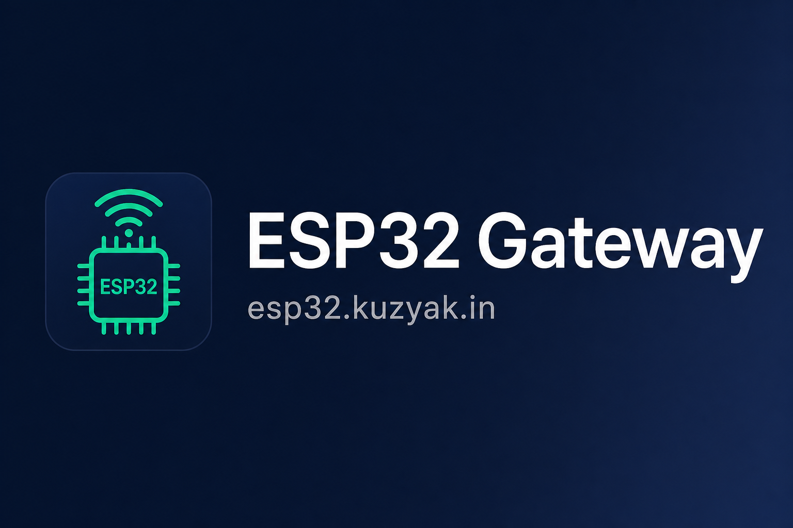
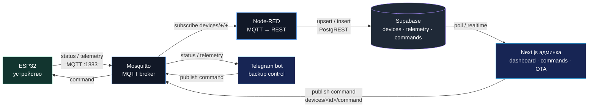

# Шлюз управления ESP32 на Raspberry Pi

Self-hosted панель управления ESP32-устройствами через MQTT, с real-time
визуализацией статуса и отправкой команд. Разворачивается одним
`docker-compose` на Raspberry Pi. Домен: **esp32.kuzyak.in**.

## Стек

| Компонент | Роль |
|-----------|------|
| **Next.js 16 (TS)** | Админка: вход по логину/паролю, дашборд, команды |
| **Mosquitto** | MQTT-брокер (ESP32 ↔ бэкенд) |
| **Node-RED** | Подписка на MQTT → запись в Supabase |
| **Telegram bot** | Резервное управление устройствами через Telegram → MQTT |
| **Supabase** | БД (твой self-hosted, подключение через общую docker-сеть) |

## Архитектура



- ESP32 публикует `devices/<id>/status` и `devices/<id>/telemetry`.
- Node-RED пишет это в таблицы `devices` и `telemetry` в Supabase.
- Админка читает данные из Supabase (поллинг через SWR) и публикует
  команды в `devices/<id>/command` напрямую в Mosquitto.
- Telegram bot — резервный MQTT bridge: подписывается на `devices/+/status`
  и `devices/+/telemetry`, а команды публикует в `devices/<id>/command`.

---

## 1. Подготовка Supabase

Твой Supabase уже крутится на Pi. Нужно:

1. **Применить схему БД.** Выполни `scripts/001_schema.sql` в SQL-редакторе
   Supabase Studio (создаёт таблицы `devices`, `telemetry`, `commands`).

2. **Узнать имя docker-сети** Supabase-стека:
   ```bash
   docker network ls | grep supabase
   # обычно supabase_default
   ```
   Впиши его в `.env` как `SUPABASE_NETWORK`.

3. **Взять ключи** из Supabase (`SERVICE_ROLE_KEY`, `ANON_KEY`) и вписать в `.env`.

---

## 2. Настройка Mosquitto

Конфиг лежит в `mosquitto/config/mosquitto.conf`. Анонимный доступ выключен —
создай файл паролей и пользователей (`esp32`, `backend`, `telegram`, `viewer`):

```bash
# создаём файл паролей (первый пользователь -c создаёт файл)
docker run --rm -it -v "$PWD/mosquitto/config:/mosquitto/config" \
  eclipse-mosquitto:2 mosquitto_passwd -c /mosquitto/config/passwd esp32
docker run --rm -it -v "$PWD/mosquitto/config:/mosquitto/config" \
  eclipse-mosquitto:2 mosquitto_passwd /mosquitto/config/passwd backend
docker run --rm -it -v "$PWD/mosquitto/config:/mosquitto/config" \
  eclipse-mosquitto:2 mosquitto_passwd /mosquitto/config/passwd telegram
docker run --rm -it -v "$PWD/mosquitto/config:/mosquitto/config" \
  eclipse-mosquitto:2 mosquitto_passwd /mosquitto/config/passwd viewer
```

ACL (`mosquitto/config/acl`) ограничивает топики: устройства пишут только в свои
`status`/`telemetry` и читают `command`; бэкенд имеет полный доступ.

Проверка брокера:
```bash
# подписка
mosquitto_sub -h <IP_Pi> -p 1883 -u viewer -P <pass> -t 'devices/#' -v
# публикация тестового статуса
mosquitto_pub -h <IP_Pi> -p 1883 -u esp32 -P <pass> \
  -t devices/esp32-test/status -m '{"status":"online"}'
```

---

## 3. Настройка Node-RED

1. Открой Node-RED на `http://<IP_Pi>:1880` после `docker compose up`.
2. Задай переменные окружения flow (передаются в контейнер из `.env`):
   `SERVICE_ROLE_KEY`, `SUPABASE_REST`.
3. Импортируй `node-red/flows.example.json` (Menu → Import).
4. Flow подписывается на `devices/+/status` и `devices/+/telemetry`,
   преобразует payload и делает upsert/insert в Supabase через PostgREST.
5. Нажми **Deploy**.

Проверка: опубликуй тестовое сообщение (см. выше) — в Debug-панели Node-RED
появится ответ PostgREST, а в таблице `devices` — новая запись.

---

## 4. Настройка Telegram-бота

Telegram-бот работает как резервный пульт управления: он не ходит в Supabase,
а напрямую слушает MQTT и публикует команды в те же топики, что и админка.

1. Создай бота через `@BotFather`:
   - отправь `/newbot`;
   - задай имя и username;
   - сохрани токен в `TELEGRAM_BOT_TOKEN`.

2. Узнай свой `chat_id`:
   - напиши боту любое сообщение;
   - открой `https://api.telegram.org/bot<TELEGRAM_BOT_TOKEN>/getUpdates`;
   - возьми `message.chat.id` и добавь в `TELEGRAM_ALLOWED_CHAT_IDS`.

3. Добавь в `.env`:
   ```env
   TELEGRAM_BOT_TOKEN=123456:replace-with-bot-token
   TELEGRAM_ALLOWED_CHAT_IDS=123456789

   TELEGRAM_DEVICE_MAP=balcony:esp32-balcony,flat:esp32-flat,cam:esp32-cam
   TELEGRAM_DEFAULT_DEVICE=balcony

   TELEGRAM_MQTT_USERNAME=telegram
   TELEGRAM_MQTT_PASSWORD=<пароль пользователя telegram из mosquitto_passwd>
   ```

`TELEGRAM_DEVICE_MAP` задаёт короткие имена для команд в Telegram:
- `balcony` → `devices/esp32-balcony/...`
- `flat` → `devices/esp32-flat/...`
- `cam` → `devices/esp32-cam/...`

Доступ разрешён только chat id из `TELEGRAM_ALLOWED_CHAT_IDS`. Если список
пустой, бот будет игнорировать все входящие сообщения.

Команды:
```text
/devices
/status [device]
/led [device] on|off
/capture [device]
/reboot [device]
/pin_read [device] <pin>
/pin_write [device] <pin> <value>
```

Примеры:
```text
/status balcony
/led balcony on
/capture cam
/reboot flat
/pin_read balcony 32
/pin_write flat 2 1
```

Бот сам присылает уведомления:
- 🔴/🟢 — устройство ушло в `offline` или вернулось в `online` (LWT брокера);
- ⚠️ — устройство числится `online`, но молчит дольше `TELEGRAM_OFFLINE_TIMEOUT`
  секунд (по умолчанию 120, `0` отключает проверку) — например, если ESP32
  завис и брокер ещё не успел опубликовать LWT;
- 🚨 — в телеметрии появилось поле `error` или пришёл статус `error`;
- 📦 — OTA завершилось со статусом `success` или `failed`.

---

## 5. Запуск всего стека

```bash
cp .env.example .env       # заполни значения
docker compose build       # собрать admin + telegram-bot
docker compose up -d        # запустить admin + mosquitto + node-red + telegram-bot
```

Сервисы после запуска:
- Админка — `http://<IP_Pi>:3000`
- Mosquitto — `:1883` (MQTT), `:9001` (WS)
- Node-RED — `:1880`
- Telegram bot — без открытых портов, long polling к Telegram Bot API

Вход в админку — логин/пароль из `ADMIN_USER` / `ADMIN_PASSWORD`.

---

## 6. Домен esp32.kuzyak.in (reverse proxy)

Админку стоит закрыть за reverse proxy с TLS. Пример для Caddy:

```
esp32.kuzyak.in {
    reverse_proxy admin:3000
}
```

Или Nginx — проксируй `esp32.kuzyak.in` → `admin:3000`, Node-RED и Mosquitto
наружу не публикуй (только в локальной сети / через VPN).

---

## 7. Прошивка ESP32

Пример — `firmware/esp32-example.ino` (PubSubClient + ArduinoJson):
- публикует `online` при подключении, `offline` через LWT при обрыве;
- шлёт телеметрию (uptime, RSSI, heap) каждые 10 с;
- слушает `devices/<id>/command` и выполняет команды (пример: реле).

---

## 8. Обновление прошивок по воздуху (OTA)

В интерфейсе встроена поддержка OTA-обновлений:
1. В карточке устройства нажмите кнопку **OTA** и выберите собранный `.bin` файл.
2. Файл сохраняется на сервере (в `public/firmware/`).
3. Бэкенд отправляет MQTT-команду устройству со ссылкой на прошивку (`{"action":"ota","url":"..."}`).
4. Устройство может публиковать прогресс скачивания в телеметрию (`{"ota":"downloading","progress":40}`).
5. В интерфейсе карточки устройства автоматически появляется прогресс-бар обновления.

## Структура проекта

```
app/                     # Next.js: страницы, API-роуты (auth, devices, command)
components/              # UI и дашборд
lib/                     # supabase-клиент, auth (HMAC-cookie), mqtt-паблишер
scripts/001_schema.sql   # схема БД для Supabase
mosquitto/config/        # конфиг + ACL брокера
node-red/                # пример flow
telegram-bot/            # Telegram ↔ MQTT bridge
firmware/                # пример прошивки ESP32
Dockerfile               # standalone-сборка админки
docker-compose.yml       # единый стек
```

## Формат данных MQTT

| Топик | Направление | Payload |
|-------|-------------|---------|
| `devices/<id>/status` | ESP32 → | `{"status":"online"}` (retained + LWT) |
| `devices/<id>/telemetry` | ESP32 → | `{"uptime":123,"rssi":-60,"heap":40000}`<br>`{"ota":"downloading","progress":40}` |
| `devices/<id>/command` | → ESP32 | `{"action":"led","value":true}`<br>`{"action":"capture"}`<br>`{"action":"reboot"}`<br>`{"action":"pin_read","pin":32}`<br>`{"action":"pin_write","pin":2,"value":1}`<br>`{"action":"ota","url":"http://..."}` |
