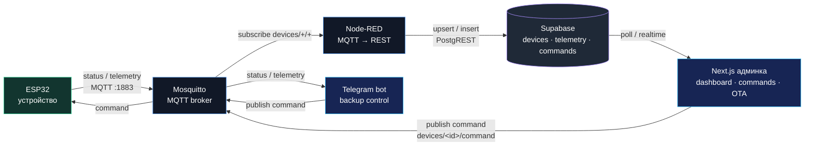

# Шлюз управления ESP32 на Raspberry Pi

Self-hosted панель управления ESP32-устройствами через MQTT, с real-time
визуализацией статуса и отправкой команд. Разворачивается одним
`docker-compose` на Raspberry Pi. Домен: **esp32.kuzyak.in**.

## Стек

| Компонент | Роль |
|-----------|------|
| **Next.js 16 (TS)** | Админка: вход по логину/паролю, дашборд, команды |
| **Mosquitto** | MQTT-брокер (ESP32 ↔ бэкенд) |
| **Node-RED** | Подписка на MQTT → запись в Supabase |
| **Telegram bot** | Резервное управление устройствами через Telegram → MQTT |
| **Supabase** | БД (твой self-hosted, подключение через общую docker-сеть) |

## Архитектура


```mermaid
flowchart LR
    esp["ESP32<br/>устройство"]
    mqtt["Mosquitto<br/>MQTT broker"]
    nodered["Node-RED<br/>MQTT → REST"]
    db[("Supabase<br/>devices · telemetry · commands")]
    admin["Next.js админка<br/>dashboard · commands · OTA"]
    tg["Telegram bot<br/>backup control"]

    esp -- "status / telemetry<br/>MQTT :1883" --> mqtt
    mqtt -- "subscribe devices/+/+" --> nodered
    nodered -- "upsert / insert<br/>PostgREST" --> db
    db -- "poll / realtime" --> admin
    admin -- "publish command<br/>devices/&lt;id&gt;/command" --> mqtt
    mqtt -- "status / telemetry" --> tg
    tg -- "publish command" --> mqtt
    mqtt -- "command" --> esp

    classDef device fill:#12352f,stroke:#35d399,color:#ffffff;
    classDef service fill:#111827,stroke:#60a5fa,color:#ffffff;
    classDef data fill:#1f2937,stroke:#a78bfa,color:#ffffff;
    classDef app fill:#172554,stroke:#38bdf8,color:#ffffff;

    class esp device;
    class mqtt,nodered service;
    class db data;
    class admin,tg app;
```

- ESP32 публикует `devices/<id>/status` и `devices/<id>/telemetry`.
- Node-RED пишет это в таблицы `devices` и `telemetry` в Supabase.
- Админка читает данные из Supabase (поллинг через SWR) и публикует
  команды в `devices/<id>/command` напрямую в Mosquitto.
- Telegram bot — резервный MQTT bridge: подписывается на `devices/+/status`,
  `devices/+/telemetry` и `devices/+/capabilities`, а команды публикует
  в `devices/<id>/command`.

---

## 1. Подготовка Supabase

Твой Supabase уже крутится на Pi. Нужно:

1. **Применить схему БД.** Выполни `scripts/001_schema.sql` в SQL-редакторе
   Supabase Studio (создаёт таблицы `devices`, `telemetry`, `commands`).

   Для дашборда MQTT-трафика дополнительно выполни `scripts/004_mqtt_events.sql`
   (таблица `mqtt_events`, Realtime, retention-функция `cleanup_mqtt_events`).

   Для удаления устройств из админки выполни `scripts/006_deleted_devices.sql`
   (без него Node-RED сразу пересоздаёт удалённое устройство из MQTT),
   `scripts/007_purge_device_rows.sql` (история устройства удаляется
   пачками — иначе на большой телеметрии удаление падает по
   `statement timeout`) и `scripts/008_block_deleted_devices.sql`
   (триггер, который не даёт вставить удалённое устройство никаким путём,
   включая старые/кастомные flows Node-RED).

   Дополнительно выполни `scripts/009_purge_speedup_and_autovacuum.sql`:
   он снимает с функции 8-секундный `statement_timeout` роли PostgREST,
   ускоряет пакетное удаление (поиск по `ctid` вместо повторного скана
   по `id`) и включает агрессивный autovacuum для `telemetry`, чтобы
   раздувание таблицы мёртвыми строками не возвращалось.
   Скрипт создаёт функцию от имени `supabase_admin` — применяй его
   от той же роли, иначе получишь `must be owner of function`.

   Последним выполни `scripts/010_retention.sql` — сроки хранения данных
   (30 дней для `telemetry`, 7 дней для `mqtt_events`) и cron-джобы
   pg_cron, которые их чистят. Подробности — в разделе
   [«10. Обслуживание БД»](#10-обслуживание-бд).

   Скрипты 009 и 010 меняют принадлежащие `supabase_admin` функции и
   таблицы, поэтому и применять их нужно от этой роли:

   ```bash
   docker exec -i supabase-db psql -U supabase_admin -d postgres \
     < scripts/010_retention.sql
   ```

2. **Узнать имя docker-сети** Supabase-стека:
   ```bash
   docker network ls | grep supabase
   # обычно supabase_default
   ```
   Впиши его в `.env` как `SUPABASE_NETWORK`.

3. **Взять ключи** из Supabase (`SERVICE_ROLE_KEY`, `ANON_KEY`) и вписать в `.env`.

---

## 2. Настройка Mosquitto

Конфиг лежит в `mosquitto/config/mosquitto.conf`. Анонимный доступ выключен —
создай файл паролей и пользователей (`esp32`, `backend`, `telegram`, `viewer`):

```bash
# создаём файл паролей (первый пользователь -c создаёт файл)
docker run --rm -it -v "$PWD/mosquitto/config:/mosquitto/config" \
  eclipse-mosquitto:2 mosquitto_passwd -c /mosquitto/config/passwd esp32
docker run --rm -it -v "$PWD/mosquitto/config:/mosquitto/config" \
  eclipse-mosquitto:2 mosquitto_passwd /mosquitto/config/passwd backend
docker run --rm -it -v "$PWD/mosquitto/config:/mosquitto/config" \
  eclipse-mosquitto:2 mosquitto_passwd /mosquitto/config/passwd telegram
docker run --rm -it -v "$PWD/mosquitto/config:/mosquitto/config" \
  eclipse-mosquitto:2 mosquitto_passwd /mosquitto/config/passwd viewer
```

ACL (`mosquitto/config/acl`) ограничивает топики: устройства пишут в свои
`status`/`telemetry`/`capabilities` и читают `command`; бэкенд имеет полный доступ.

### Пересекающиеся подписки (важно)

У Node-RED есть и точные подписки (`devices/+/status`, `devices/+/telemetry`,
`devices/+/capabilities`), и общий `devices/#` для аудита. Mosquitto по
умолчанию отправляет копию сообщения на **каждую** совпавшую подписку, поэтому
каждое сообщение устройства обрабатывалось дважды: телеметрия ложилась двумя
строками, а `mqtt_events` — двумя записями (ровно 50 % строк в обеих таблицах
были копиями, и таблица телеметрии росла вдвое быстрее нужного).

В `mosquitto.conf` это выключено:

```
allow_duplicate_messages false
```

Проверка — один клиент с двумя пересекающимися фильтрами не должен получать
сообщение дважды:

```bash
pw=$(grep -m1 '^MQTT_PASSWORD=' .env | cut -d= -f2- | tr -d '"')
docker exec esp32-mosquitto mosquitto_sub -h localhost -u backend -P "$pw" \
  -t 'devices/+/telemetry' -t 'devices/#' -W 25 -v | wc -l
```

Опция есть начиная с Mosquitto 2.1. На более старых версиях дубли можно убрать
только разведением пересекающихся подписок по разным клиентам (двум broker-нодам
Node-RED с разными clientid).

Проверка брокера:
```bash
# подписка
mosquitto_sub -h <IP_Pi> -p 1883 -u viewer -P <pass> -t 'devices/#' -v
# публикация тестового статуса
mosquitto_pub -h <IP_Pi> -p 1883 -u esp32 -P <pass> \
  -t devices/esp32-test/status -m '{"status":"online"}'
```

---

## 3. Настройка Node-RED

1. Открой Node-RED на `http://<IP_Pi>:1880` после `docker compose up`.
2. Задай переменные окружения flow (передаются в контейнер из `.env`):
   `SERVICE_ROLE_KEY`, `SUPABASE_REST`.
3. Импортируй `node-red/flows.example.json` (Menu → Import).
4. Flow подписывается на `devices/+/status`, `devices/+/telemetry`,
   `devices/+/capabilities` и `devices/#` (audit log → `mqtt_events`), преобразует
   payload и делает upsert/insert в Supabase через PostgREST.
   Внимание: эти подписки пересекаются — без `allow_duplicate_messages false`
   в `mosquitto.conf` каждое сообщение придёт дважды (см. раздел 2).
5. Нажми **Deploy**.

Проверка: опубликуй тестовое сообщение (см. выше) — в Debug-панели Node-RED
появится ответ PostgREST, а в таблице `devices` — новая запись. Сообщение также
появится в таблице `mqtt_events` и на странице `/dashboard/traffic`.

**Retention audit log.** Таблица `mqtt_events` растёт с каждым MQTT-сообщением.
Рекомендуется настроить автоочистку **через SQL** (pg_cron внутри Postgres):

```sql
-- Выполни scripts/005_mqtt_events_retention_cron.sql в Supabase Studio
-- Проверка:
SELECT jobid, jobname, schedule, command FROM cron.job WHERE jobname = 'cleanup-mqtt-events';
```

Ручной запуск (для теста): `SELECT public.cleanup_mqtt_events(7);`

Альтернатива — системный cron на Pi, если pg_cron недоступен:

```bash
# crontab -e
0 3 * * * docker exec -i supabase-db psql -U postgres -d postgres -c "SELECT public.cleanup_mqtt_events(7);"
```

Имя контейнера БД может отличаться — проверь `docker ps | grep db`.

---

## 4. Настройка Telegram-бота

Telegram-бот работает как резервный пульт управления: он напрямую слушает MQTT
и публикует команды в те же топики, что и админка. Supabase ему не обязателен —
если он доступен, бот берёт оттуда только названия и порядок устройств.
Команды можно отправлять как текстом, так и через inline-кнопки.

1. Создай бота через `@BotFather`:
   - отправь `/newbot`;
   - задай имя и username;
   - сохрани токен в `TELEGRAM_BOT_TOKEN`.
   - (опционально) установи аватарку — `/setuserpic` в BotFather, файл `telegram-bot/avatar.png`

2. Узнай свой `chat_id`:
   - напиши боту любое сообщение;
   - открой `https://api.telegram.org/bot<TELEGRAM_BOT_TOKEN>/getUpdates`;
   - возьми `message.chat.id` и добавь в `TELEGRAM_ALLOWED_CHAT_IDS`.

3. Добавь в `.env`:
   ```env
   TELEGRAM_BOT_TOKEN=123456:replace-with-bot-token
   TELEGRAM_ALLOWED_CHAT_IDS=123456789

   TELEGRAM_MQTT_USERNAME=telegram
   TELEGRAM_MQTT_PASSWORD=<пароль пользователя telegram из mosquitto_passwd>
   ```

### Список устройств

Устройства в боте появляются сами — прописывать их не нужно:

- **из MQTT** — любое устройство, приславшее `status`, `telemetry` или
  `capabilities` в `devices/<id>/...`, сразу попадает в клавиатуру
  «📟 Устройства»;
- **из админки** (если заданы `SUPABASE_REST` и `SUPABASE_SERVICE_ROLE_KEY` —
  в `docker-compose.yml` они уже прокинуты, контейнер подключён к сети
  `supabase`) — бот раз в `TELEGRAM_SYNC_INTERVAL` секунд (60 по умолчанию)
  подтягивает список `devices`: названия и порядок как в админке, устройства,
  которые ещё молчат, тоже видны. Удалённое в админке устройство пропадает и
  из бота, уведомления о нём не приходят. Если Supabase недоступен, бот
  продолжает работать только по MQTT.

Необязательные настройки:

```env
# Короткие имена для текстовых команд: /status balcony, /led balcony on
TELEGRAM_DEVICE_MAP=balcony:esp32-balcony,flat:esp32-flat
# Устройство для команд без имени (/reboot, /capture); иначе первое в списке
TELEGRAM_DEFAULT_DEVICE=balcony
```

В текстовых командах устройство можно указать коротким именем из
`TELEGRAM_DEVICE_MAP`, его `device_id` или названием из админки
(`/status Спальня`).

Доступ разрешён только chat id из `TELEGRAM_ALLOWED_CHAT_IDS`. Если список
пустой, бот будет игнорировать все входящие сообщения.

### Команды

```text
/devices              — список устройств кнопками
/dashboard или /all   — сводка по всем устройствам
/status [device]      — карточка устройства: метрики + кнопки команд
/commands [device]    — то же, что /status

/led [device] on|off  — управление LED
/capture [device]     — снимок с камеры
/reboot [device]      — перезагрузка с подтверждением

/pin_read [device] <pin>
/pin_write [device] <pin> <value>
```

### Кнопки устройства

Кнопки у каждого устройства свои — бот строит их из retained-топика
`devices/<id>/capabilities` (тот же JSON, по которому рисует команды админка):

| `type` команды | Кнопка в Telegram |
|---|---|
| `toggle`  | одна кнопка с текущим состоянием (`🟢 … · вкл` / `⚫️ … · выкл`), нажатие переключает |
| `range`   | ряд `➖ [значение] ➕`; шаг — `step` или 10% от `min`…`max` |
| `trigger` | обычная кнопка; `reboot`/`restart`/`reset`/`ota`/`format`/`erase` — через подтверждение |

Текущее состояние toggle/range берётся из поля телеметрии с тем же именем,
что и `action`. Иконки (`icon`) переводятся в эмодзи (`lightbulb` → 💡,
`sun` → ☀️, `rotate-cw` → 🔄 …). Если в телеметрии есть `capture_url`
или `camera_ready`, добавляется кнопка «📸 Снимок». У устройства без
capabilities остаются только «Обновить» и «Устройства».

Нажатия не плодят новые сообщения: бот правит ту же карточку, отправляет
команду, ждёт до 4 с ответной телеметрии и показывает под карточкой
`✅ выполнено` или `📨 отправлено, ответа пока нет`.

> Для этого пользователю `telegram` в `mosquitto/config/acl` нужен доступ
> `topic read devices/+/capabilities` (уже добавлен; после обновления ACL
> перезапусти mosquitto).

### Формат карточки

Метрики выводятся по схеме `metrics` из capabilities: подписи, иконки,
форматы (`rssi`, `uptime`, `bytes`, `percent`, `boolean` …), группы и порядок —
как на странице устройства в админке. Без схемы используется набор по умолчанию
(IP, RSSI, аптайм, RAM, температура, влажность, OTA).

```
🟢 bedroom  ·  в сети
esp32-bedroom  ·  только что

🌐 Сеть
┃ 🌐 IP-адрес: 192.168.1.42
┃ 📶 Сигнал Wi-Fi: -58 dBm  █████░░░

💻 Система
┃ ⏱ Аптайм: 1 дн 2 ч
┃ 🧠 Свободная RAM: 178.1 КБ

📍 Camelion
┃ 💡 Лампа: вкл
┃ ☀️ Яркость: 80 %  ██████░░

[🟢 Лампа Camelion · вкл]
[➖] [☀️ Яркость · 80] [➕]
[🔄 Перезагрузка]
[⟳ Обновить] [← Устройства]
```

Сводка (`/dashboard`) показывает по каждому устройству метрики из
`dashboard.summary` скетча (или помеченные `"dashboard": true`).

### Уведомления

Бот сам присылает уведомления:
- 🔴/🟢 — статус изменился (показывает старый → новый);
- ⚠️ — устройство числится `online`, но молчит дольше `TELEGRAM_OFFLINE_TIMEOUT`
  секунд (по умолчанию 120, `0` отключает проверку);
- 🟢 — устройство снова на связи (с указанием длительности молчания);
- 🚨 — в телеметрии появилось поле `error` или пришёл статус `error`;
- 📦 — OTA завершилось со статусом `success` или `failed` (с прогресс-баром).

---

## 5. Запуск всего стека

```bash
cp .env.example .env       # заполни значения
docker compose build       # собрать admin + telegram-bot
docker compose up -d        # запустить admin + mosquitto + node-red + telegram-bot
```

Сервисы после запуска:
- Админка — `http://<IP_Pi>:3000`
- Mosquitto — `:1883` (MQTT), `:9001` (WS)
- Node-RED — `:1880`
- Telegram bot — без открытых портов, long polling к Telegram Bot API

Вход в админку — логин/пароль из `ADMIN_USER` / `ADMIN_PASSWORD`.

---

## 6. Домен esp32.kuzyak.in (reverse proxy)

Админку стоит закрыть за reverse proxy с TLS. Пример для Caddy:

```
esp32.kuzyak.in {
    reverse_proxy admin:3000
}
```

Или Nginx — проксируй `esp32.kuzyak.in` → `admin:3000`, Node-RED и Mosquitto
наружу не публикуй (только в локальной сети / через VPN).

---

## 7. Прошивка ESP32

Примеры в `firmware/`:

- **`esp32-example.ino`** — базовая заготовка (PubSubClient + ArduinoJson):
  - публикует `online` при подключении, `offline` через LWT при обрыве;
  - шлёт телеметрию (uptime, RSSI, heap) каждые 10 с;
  - слушает `devices/<id>/command` и выполняет команды (пример: реле).

- **`esp32-bedroom.ino`** — управление Camelion WiFi-лампой через KY-040 энкодер:
  - KY-040: CLK→GPIO25, DT→GPIO26, SW→GPIO27, INPUT_PULLUP, с автоускорением;
  - поворот → яркость, нажатие → вкл/выкл, удержание+поворот → цветовая температура;
  - MQTT-команды: `camelion_power`, `camelion_brightness`, `camelion_temp`, `reboot`;
  - relay-топик `devices/esp32-bedroom/out/camelion` → Python-мост на RPi;
  - телеметрия сразу после смены состояния + каждые 10 с;
  - LED (GPIO 2) выключен по умолчанию.

- **`camelion_bridge.py`** — Python-мост для управления Tuya-лампой через Cloud API:
  - подписывается на `devices/esp32-bedroom/out/camelion`;
  - управляет лампой через `tinytuya.Cloud`;
  - публикует состояние лампы в `devices/camelion/telemetry` (retained);
  - опрашивает лампу раз в 60 с.

Каждый скетч сам декларирует свои команды и метрики через retained-топик `devices/<id>/capabilities`.

### Кормушка (esp32-cam)

Камера сама ищет птиц и хранит их снимки на SD; шлюз только кэширует кадр
(1 с) и отдаёт его сайту через `/api/camera/birdfeeder{,/frame,/bird}` под
`CAMERA_API_TOKEN`. Новых контейнеров нет. Подробности, проверка и калибровка —
[docs/birdfeeder.md](docs/birdfeeder.md).

---

## 8. Интерфейс админки

Админка рассчитана на то, чтобы ей пользовался не только разработчик:
на виду — состояние и управление, всё техническое — в одном свёрнутом разделе.

### Главная — «Устройства»

Логотип в шапке всегда ведёт сюда; вкладки «Устройства» / «Трафик» показывают,
где вы находитесь.

- Под заголовком — сводка «3 из 4 в сети».
- Карточка устройства: название, статус словами («В сети · обновлено 5 с назад» /
  «Нет связи · 3 ч назад»), до 4 главных показаний и переключатели (`toggle`,
  до трёх) — лампу или реле можно переключить прямо с главной.
- Нажатие на карточку открывает страницу устройства.
- **Изменить порядок** — режим со стрелками ↑/↓ на карточках; порядок
  сохраняется сразу, кнопка **Готово** возвращает обычный вид.

### Страница устройства

Сверху вниз:
1. **Название** (карандаш — переименовать) и статус. Если устройство не на связи,
   показывается подсказка, а управление блокируется.
2. **Управление** — команды из `capabilities` скетча:
   - `toggle` → переключатель с текущим состоянием;
   - `range` → ползунок (`min`/`max`/`step`/`unit`), значение уходит на
     устройство через 0,4 с после того, как ползунок отпустили;
   - `trigger` → кнопка «Выполнить».

   Пока команда выполняется, рядом крутится индикатор. Когда устройство
   присылает телеметрию с новым состоянием, появляется «✓ Готово». Если ответа
   нет 8 с — всплывает предупреждение.
3. **Камера** — последний снимок и кнопка «Сделать снимок» (если в телеметрии
   есть `camera_ready` / `last_photo_url`).
4. **Показания** — метрики по группам из схемы `metrics`. То, чем управляют
   переключатели и ползунки, здесь не дублируется.
5. **Обслуживание** (свёрнуто): ID, IP и версия прошивки, обновление прошивки
   (OTA), опасные команды (`reboot`, `reset`, …) с подтверждением, пины GPIO,
   файлы, блок «Для разработчиков» (произвольная JSON-команда и справочник
   MQTT-топиков) и удаление устройства.

Форматы метрик (`format` в схеме) — `percent`, `rssi`, `uptime`, `bytes`,
`temperature`, `boolean` (показывается как «Вкл/Выкл»), `number`, `text` —
имеют приоритет над догадками по имени ключа.

## 9. Обновление прошивок по воздуху (OTA)

В интерфейсе встроена поддержка OTA-обновлений:
1. На странице устройства откройте **Обслуживание → Обновить прошивку (.bin)**
   и выберите собранный `.bin` файл.
2. Файл сохраняется на сервере (в `public/firmware/`).
3. Бэкенд отправляет MQTT-команду устройству со ссылкой на прошивку (`{"action":"ota","url":"..."}`).
4. Устройство может публиковать прогресс скачивания в телеметрию (`{"ota":"downloading","progress":40}`).
5. Под названием устройства (и на карточке на главной) появляется прогресс обновления.

## 10. Обслуживание БД

### Retention (сроки хранения)

`scripts/010_retention.sql` заводит две функции и две cron-джобы
(pg_cron внутри Postgres, время в UTC):

| Таблица | Хранение | Джоба | Расписание |
|---------|----------|-------|------------|
| `telemetry` | 30 дней | `cleanup-telemetry` | ежедневно 04:00 |
| `mqtt_events` | 7 дней | `cleanup-mqtt-events` | ежедневно 03:00 |

Столько, сколько нужно интерфейсу, хватило бы и меньше: `/api/flamingo`
читает окно 24 ч, страница устройства — последние 50 строк телеметрии.
30 дней оставлены с запасом на ручной разбор инцидентов.

```sql
-- проверить, что джобы живы и отрабатывают
select jobid, jobname, schedule, command from cron.job order by jobid;
select jobid, status, return_message, start_time
  from cron.job_run_details order by start_time desc limit 5;
```

Обе функции вызываются только из `pg_cron`: `EXECUTE` отозван у
`public`, `anon` и `authenticated`. Без этого любой вошедший в админку
мог бы позвать их через PostgREST как RPC — например
`cleanup_telemetry(0)` — и стереть всю историю.

### Разгрести накопившийся backlog

Штатная джоба удаляет всё устаревшее за один вызов. Если накопились
миллионы строк, удаляй порциями — каждый вызов идёт своей транзакцией
(второй аргумент включает пакетный режим):

```bash
for i in $(seq 1 60); do
  n=$(docker exec supabase-db psql -U postgres -d postgres -tAc \
    "select public.cleanup_mqtt_events(7, 50000);" | tr -d ' \n')
  echo "удалено: $n"
  [ "$n" -lt 50000 ] && break
done
```

### Bloat и autovacuum

`telemetry` и `mqtt_events` постоянно растут и постоянно чистятся.
Порог autovacuum по умолчанию (20 % от размера таблицы) для них слишком
грубый: на 1,2 млн строк это ~250 тыс. мёртвых кортежей, которых можно
и не дождаться. Скрипты 009 и 010 ставят обеим таблицам
`autovacuum_vacuum_scale_factor = 0.02` — чистка стартует примерно на
25 тыс. мёртвых строк.

```sql
-- если раздувание всё же накопилось
select relname, n_live_tup, n_dead_tup,
       pg_size_pretty(pg_total_relation_size(relid))
  from pg_stat_user_tables
 where relname in ('telemetry', 'mqtt_events');

set max_parallel_maintenance_workers = 0;  -- см. следующий раздел
vacuum (analyze) public.telemetry;
```

Обычный `VACUUM` не уменьшает файл на диске, а только помечает место
свободным для повторного использования. Вернуть место ОС умеет
`VACUUM FULL`, но он блокирует таблицу — при 67 ГБ свободного места это
не срочно.

### /dev/shm в контейнере Supabase

Docker по умолчанию даёт контейнеру 64 МБ `/dev/shm`, а PostgreSQL
использует его для dynamic shared memory. При таком размере падают
параллельный `VACUUM` и параллельные запросы:

```
ERROR: could not resize shared memory segment "/PostgreSQL.…" to 67151648 bytes:
No space left on device
```

Лечится в `docker-compose.yml` Supabase-стека, сервис `db`:

```yaml
  db:
    container_name: supabase-db
    shm_size: 1gb
```

```bash
cd ~/Projects/supabase/docker
docker compose up -d db      # данные в ./volumes/db/data не затрагиваются
docker exec supabase-db df -h /dev/shm   # должно быть 1.0G
```

## Структура проекта

```
app/                     # Next.js: страницы, API-роуты (auth, devices, command)
components/              # UI и дашборд
lib/                     # supabase-клиент, auth (HMAC-cookie), mqtt-паблишер
scripts/                 # SQL-миграции 001–010 (схема, retention, обслуживание)
mosquitto/config/        # конфиг + ACL брокера
node-red/                # пример flow
telegram-bot/            # Telegram ↔ MQTT bridge (+ avatar.svg, avatar.png)
firmware/                # пример прошивки ESP32
Dockerfile               # standalone-сборка админки
docker-compose.yml       # единый стек
```

## Формат данных MQTT

| Топик | Направление | Payload |
|-------|-------------|---------|
| `devices/<id>/status` | ESP32 → | `{"status":"online"}` (retained + LWT) |
| `devices/<id>/telemetry` | ESP32 → | `{"uptime":123,"rssi":-60,"heap":40000}`<br>`{"ota":"downloading","progress":40}` |
| `devices/<id>/capabilities` | ESP32 → | `{"commands":[{"action":"led","title":"Свет","type":"toggle"}, {"action":"brightness","title":"Яркость","type":"range","min":0,"max":100}]}` (retained) |
| `devices/<id>/out/camelion` | ESP32 → | `{"action":"power","value":1}` — relay на Python-мост (RPi) |
| `devices/<id>/command` | → ESP32 | `{"action":"led","value":true}`<br>`{"action":"capture"}`<br>`{"action":"reboot"}`<br>`{"action":"pin_read","pin":32}`<br>`{"action":"pin_write","pin":2,"value":1}`<br>`{"action":"camelion_power","value":true}`<br>`{"action":"camelion_brightness","value":75}`<br>`{"action":"camelion_temp","value":30}`<br>`{"action":"ota","url":"http://..."}` |

---

## FAQ

### 🖼️ Камера не показывает снимок (AbortError / 504)

Симптом: в логах `[Camera Proxy] Fetch error — AbortError`, браузер показывает
битую иконку вместо снимка.

**Причина:** ESP32-CAM и сервер (Raspberry Pi) оказались в разных подсетях.
Сервер не мог достучаться до камеры по IP.

**Решение:** подключить Raspberry Pi к той же WiFi-сети, что и ESP32-CAM
(или наоборот — настроить камеру на сеть сервера). После этого снимки
начинают приходить нормально.

### 📡 Telegram-бот не отвечает на команды

1. Проверь, что `TELEGRAM_BOT_TOKEN` в `.env` корректный.
2. Убедись, что твой `chat_id` добавлен в `TELEGRAM_ALLOWED_CHAT_IDS`.
3. Проверь логи: `docker compose logs telegram-bot`.
4. Бот использует long polling — порты открывать не нужно.

### 🔌 Устройство не появляется в админке

1. Проверь, что ESP32 подключено к MQTT-брокеру (лог прошивки).
2. Проверь Mosquitto: `docker compose logs mosquitto`.
3. Проверь Node-RED: открыть `http://<IP_Pi>:1880`, посмотреть Debug-панель.
4. Убедись, что в таблице `devices` появилась запись с `device_id`.

### 🗑️ Устройство не удаляется: statement timeout

Симптом: в логах админки `[DELETE Device] Purge error: canceling statement
  due to statement timeout`, устройство остаётся на дашборде.

**Причина:** PostgREST подключается ролью `authenticator` с
`statement_timeout = 8s`, и этот лимит наследуют запросы админки. Пока
история устройства удалялась одним каскадным `DELETE`, на раздутой
таблице (`telemetry` в миллионы строк) запрос не укладывался в 8 секунд.

**Решение:** должны быть применены `scripts/007_purge_device_rows.sql`
(удаление пачками), `scripts/008_block_deleted_devices.sql` и
`scripts/009_purge_speedup_and_autovacuum.sql` — последний даёт функции
свой `statement_timeout`, ищет строки по `ctid` и включает autovacuum.

```sql
select proconfig from pg_proc where proname = 'purge_device_rows';
-- ожидаем {statement_timeout=120s,lock_timeout=30s}
```

Если устройство уже помечено удалённым в `deleted_devices`, но строка в
`devices` осталась, домели очистку вручную:

```sql
do $$
declare n int;
begin
  loop
    n := public.purge_device_rows('<device_id>', 5000);
    exit when n = 0;
  end loop;
end $$;
delete from public.devices where device_id = '<device_id>';
```

Удаление также стирает retained-сообщения устройства в брокере (`status`,
`telemetry`, `capabilities`). Без этого Node-RED получает их при каждом
переподключении и снова пишет в `mqtt_events` (а если устройство ещё есть
в таблице — и в `telemetry`).

Топики `devices/<id>/out/…` не чистятся: их имена задаёт прошивка, заранее
их перечислить нельзя. Если устройство оставило там retained — убери вручную:

```bash
pw=$(grep -m1 '^MQTT_PASSWORD=' .env | cut -d= -f2- | tr -d '"')
docker exec esp32-mosquitto mosquitto_pub -h localhost -u backend -P "$pw" \
  -t 'devices/<id>/out/<name>' -r -n      # -r + -n = пустой retained
```

Проверить, что retained больше нет:

```bash
docker exec esp32-mosquitto mosquitto_sub -h localhost -u backend -P "$pw" \
  -t 'devices/#' -W 5 -v --retained-only
```
